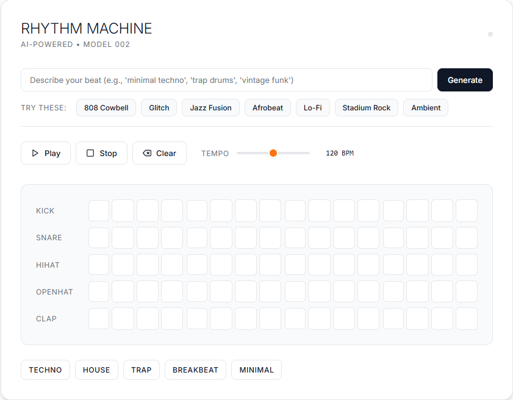

# 🎵 RHYTHM MACHINE

> An AI-powered drum sequencer that brings your beat ideas to life in seconds

[](https://claude.ai)
[](https://opensource.org/licenses/MIT)
[](https://developer.mozilla.org/en-US/docs/Web/HTML)
[](https://developer.mozilla.org/en-US/docs/Web/API/Web_Audio_API)

---

## Preview
<p align="center">
  
</p>

## 🌟 What is Rhythm Machine?

Rhythm Machine is an **interactive drum sequencer** that combines the power of AI with intuitive beat-making. Whether you're a musician looking for inspiration, a producer sketching out ideas, or someone who just loves rhythm, this tool transforms your creative vision into playable drum patterns instantly.

### ✨ Key Features

- 🤖 **AI-Powered Beat Generation** - Describe your beat in natural language, and watch it come to life
- 🎹 **16-Step Sequencer** - Classic drum machine interface with 5 instrument tracks
- 🎨 **Beautiful Minimal Design** - Clean, modern interface that stays out of your way
- 🔊 **Real-Time Audio Synthesis** - Browser-based sound generation using Web Audio API
- 📦 **Preset Library** - Instant access to Techno, House, Trap, Breakbeat, and Minimal patterns
- ⚡ **Zero Dependencies** - Pure HTML, CSS, and JavaScript—no installation required
- 📱 **Responsive Layout** - Works seamlessly on desktop, tablet, and mobile devices

---

## 🎯 How It Works

### The Magic Behind the Beats

1. **Describe Your Vision** 💭
   - Type what you're hearing: "minimal techno", "808 cowbell rhythm", "jazz fusion groove"
   - Or click one of the quick-start ideas for instant inspiration

2. **AI Classification** 🧠
   - Claude AI analyzes your description
   - Matches it to the closest musical genre
   - Loads an appropriate drum pattern as your starting point

3. **Customize & Play** 🎛️
   - Click any step in the sequencer to toggle drum hits
   - Adjust tempo from 60 to 180 BPM
   - Hit play and hear your creation come alive

4. **Sound Synthesis** 🔉
   - Each instrument is synthesized in real-time using Web Audio API
   - Kick drums use frequency sweeps
   - Snares combine oscillators with noise
   - Hi-hats use square wave synthesis
   - Claps use filtered noise bursts

---

## 🚀 Getting Started

### Quick Start

1. **Open the file** in any modern web browser (Chrome, Firefox, Safari, Edge)
2. **Try a preset** - Click "Techno" or "House" to load a pattern instantly
3. **Hit Play** ▶️ - Start the sequencer and hear your beat
4. **Experiment** - Click steps to create your own patterns

### AI Generation

```
1. Type in the input field: "trap drums"
2. Click "Generate" button
3. Watch as Claude creates a matching beat pattern
4. Customize the pattern to your liking
```

### Manual Beat Creation

- **Click any square** in the sequencer grid to toggle a drum hit
- **Each row** represents a different instrument (Kick, Snare, HiHat, OpenHat, Clap)
- **Each column** represents a 16th note in the pattern
- **Visual feedback** shows which steps are active (orange) and currently playing

---

## 💡 How It Can Help You

### For Musicians & Producers 🎸

- **Quick Sketching** - Rapidly prototype drum patterns without opening a DAW
- **Rhythm Reference** - Create reference beats for songwriting sessions
- **Learning Tool** - Study different genre conventions through presets
- **Practice Aid** - Generate backing tracks for instrument practice

### For Educators 👨‍🏫

- **Music Theory** - Demonstrate rhythm patterns and time signatures
- **Genre Study** - Compare characteristic beats from different musical styles
- **Interactive Learning** - Students can experiment with rhythm composition
- **Accessibility** - No expensive software or hardware needed

### For Content Creators 🎥

- **Quick Loops** - Generate simple beats for background music
- **Sound Design** - Create rhythmic elements for videos
- **Inspiration** - Overcome creative blocks with AI-generated ideas
- **Prototyping** - Test rhythm ideas before full production

### For Developers 🧑‍💻

- **Web Audio Example** - Learn from a working implementation
- **AI Integration** - See how to connect Claude API to creative tools
- **UI/UX Reference** - Study clean, functional interface design
- **Code Learning** - Understand sequencer logic and timing

---

## 🛠️ Technical Details

### Technologies Used

- **HTML5** - Semantic structure
- **CSS3** - Custom properties, Grid, Flexbox
- **Vanilla JavaScript** - No frameworks, pure ES6+
- **Web Audio API** - Real-time sound synthesis
- **Claude AI API** - Natural language beat generation

### Browser Requirements

- Modern browser with Web Audio API support
- JavaScript enabled
- No plugins or extensions required

### Audio Engine

The synthesizer creates sounds programmatically:

```javascript
// Kick Drum - Low frequency sweep
Frequency: 150Hz → 0.01Hz (500ms decay)
Envelope: Exponential decay

// Snare - Oscillator + White Noise
Frequency: 200Hz → 100Hz (100ms)
Noise: Filtered white noise (200ms)

// Hi-Hat - High frequency square wave
Frequency: 800Hz
Duration: 50ms (closed) / 300ms (open)

// Clap - Short noise burst
White Noise: 100ms with exponential decay
```

---

## 🎨 Customization Ideas

Want to make it your own? Here are some ideas:

### Easy Modifications

- 🎨 **Change Colors** - Edit CSS custom properties in `:root`
- 🥁 **Add Instruments** - Expand the `instruments` array
- 📐 **More Steps** - Increase `STEPS` constant (try 32 steps!)
- 🎼 **New Presets** - Add your own patterns to the `presets` object

### Advanced Enhancements

- 💾 **Save/Load Patterns** - Add localStorage functionality
- 🎛️ **Per-Track Volume** - Individual gain controls
- 🎚️ **Swing/Shuffle** - Implement groove quantization
- 🎵 **Export Audio** - Record and download WAV files
- 🌈 **Visualizer** - Add frequency spectrum display
- 🎹 **MIDI Support** - Connect external controllers

---

## 🤝 Contributing

We welcome contributions from the community! Here's how you can help:

### Ways to Contribute

1. **🐛 Report Bugs**
   - Open an issue with detailed steps to reproduce
   - Include browser version and error messages
   - Screenshots are super helpful!

2. **💡 Suggest Features**
   - Share your ideas in the issues section
   - Explain the use case and benefits
   - Vote on existing feature requests

3. **📝 Improve Documentation**
   - Fix typos or unclear instructions
   - Add examples or tutorials
   - Translate to other languages

4. **💻 Submit Code**
   - Fork the repository
   - Create a feature branch
   - Write clean, commented code
   - Test thoroughly across browsers
   - Submit a pull request

### Development Guidelines

```bash
# Testing checklist
✓ Works in Chrome, Firefox, Safari, Edge
✓ Mobile responsive (test on actual devices)
✓ Audio plays correctly in all scenarios
✓ No console errors
✓ Code follows existing style
✓ Comments explain complex logic
```

### Code Style

- Use meaningful variable names
- Comment complex sections
- Keep functions focused and small
- Follow existing formatting patterns
- Use modern JavaScript (ES6+)

---

## 🎓 Learning Resources

### Understanding the Code

- **Web Audio API** - [MDN Documentation](https://developer.mozilla.org/en-US/docs/Web/API/Web_Audio_API)
- **JavaScript Timing** - Learn about `setInterval` and timing accuracy
- **CSS Grid** - [Complete Guide](https://css-tricks.com/snippets/css/complete-guide-grid/)
- **Event Handling** - DOM event listeners and delegation

### Music Theory

- **16th Notes** - Understanding musical subdivisions
- **Drum Programming** - Genre-specific pattern conventions
- **Synthesis Basics** - How oscillators create sound
- **Rhythm & Groove** - What makes beats feel good

---

## 🔮 Roadmap

### Planned Features

- [ ] 🎵 **Pattern Saving** - Store and recall your creations
- [ ] 🎤 **Audio Recording** - Export your beats as WAV files
- [ ] 🎹 **More Sounds** - Additional drum kits (808, 909, acoustic)
- [ ] 🌊 **Effects** - Reverb, delay, distortion
- [ ] 📊 **Visualizer** - Real-time audio visualization
- [ ] 🎮 **Keyboard Shortcuts** - Spacebar to play/pause, etc.
- [ ] 🔄 **Pattern Randomizer** - Generate random variations
- [ ] 📱 **PWA Support** - Install as standalone app
- [ ] 🌐 **Pattern Sharing** - Export and import patterns as JSON
- [ ] 🎨 **Theme Switcher** - Light/dark mode toggle

---

## ❓ FAQ

**Q: Why doesn't sound play on my phone?**  
A: iOS requires user interaction before audio. Tap the screen once, then try playing.

**Q: Can I use this offline?**  
A: Yes! Save the HTML file locally. AI generation requires internet.

**Q: What browsers are supported?**  
A: Chrome, Firefox, Safari, and Edge (latest 2 versions).

**Q: Can I use these beats in my music?**  
A: Absolutely! All generated patterns are free to use.

**Q: Why do some beats sound different than expected?**  
A: The AI classifies descriptions into preset categories. Customize patterns manually for exact results.

**Q: How accurate is the timing?**  
A: JavaScript timing has some limitations. For production use, consider exporting to a DAW.

---

## 📄 License

This project is licensed under the **MIT License** - see below for details:

```
MIT License

Copyright (c) 2024 Rhythm Machine

Permission is hereby granted, free of charge, to any person obtaining a copy
of this software and associated documentation files (the "Software"), to deal
in the Software without restriction, including without limitation the rights
to use, copy, modify, merge, publish, distribute, sublicense, and/or sell
copies of the Software, and to permit persons to whom the Software is
furnished to do so, subject to the following conditions:

The above copyright notice and this permission notice shall be included in all
copies or substantial portions of the Software.

THE SOFTWARE IS PROVIDED "AS IS", WITHOUT WARRANTY OF ANY KIND, EXPRESS OR
IMPLIED, INCLUDING BUT NOT LIMITED TO THE WARRANTIES OF MERCHANTABILITY,
FITNESS FOR A PARTICULAR PURPOSE AND NONINFRINGEMENT. IN NO EVENT SHALL THE
AUTHORS OR COPYRIGHT HOLDERS BE LIABLE FOR ANY CLAIM, DAMAGES OR OTHER
LIABILITY, WHETHER IN AN ACTION OF CONTRACT, TORT OR OTHERWISE, ARISING FROM,
OUT OF OR IN CONNECTION WITH THE SOFTWARE OR THE USE OR OTHER DEALINGS IN THE
SOFTWARE.
```

---

## 🙏 Acknowledgments

- **Claude AI** by Anthropic - For enabling natural language beat generation
- **Web Audio API** - For making browser-based synthesis possible
- **The Music Community** - For inspiring rhythm and creativity
- **You** - For being part of this project! 🎉

---

## 🔗 Connect & Share

Found this project helpful? Give it a ⭐ and share it with fellow musicians and developers!

**Built with ❤️ by the community, powered by Claude AI**

---

## 🎊 Fun Facts

- 🎸 The 808 drum machine (inspiration for our Kick drum) was released in 1980
- 🎼 A 16-step sequencer at 120 BPM plays one complete pattern every 2 seconds
- 🔊 Web Audio API can generate thousands of sounds simultaneously
- 🤖 This entire project runs in your browser—no server needed!
- 🎵 Drum machines revolutionized music production in the 1980s

---

<div align="center">

### Ready to make some beats? 🎵

**Drop a beat, share your creation, and keep the rhythm alive!**

[⬆ Back to Top](#-rhythm-machine)

</div>
